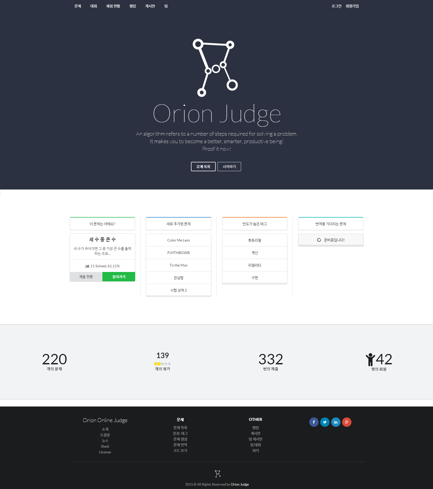
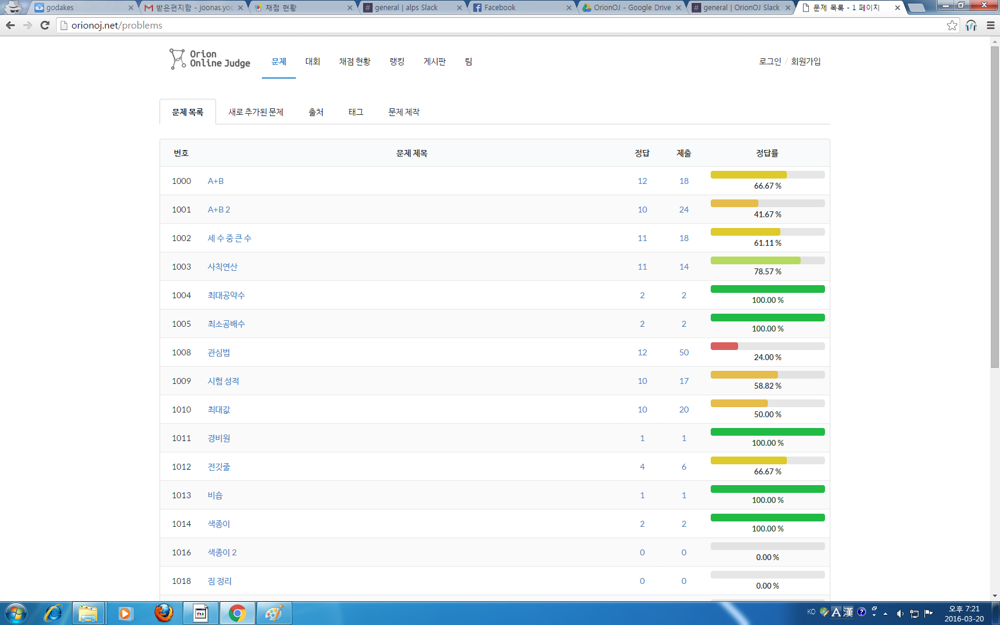
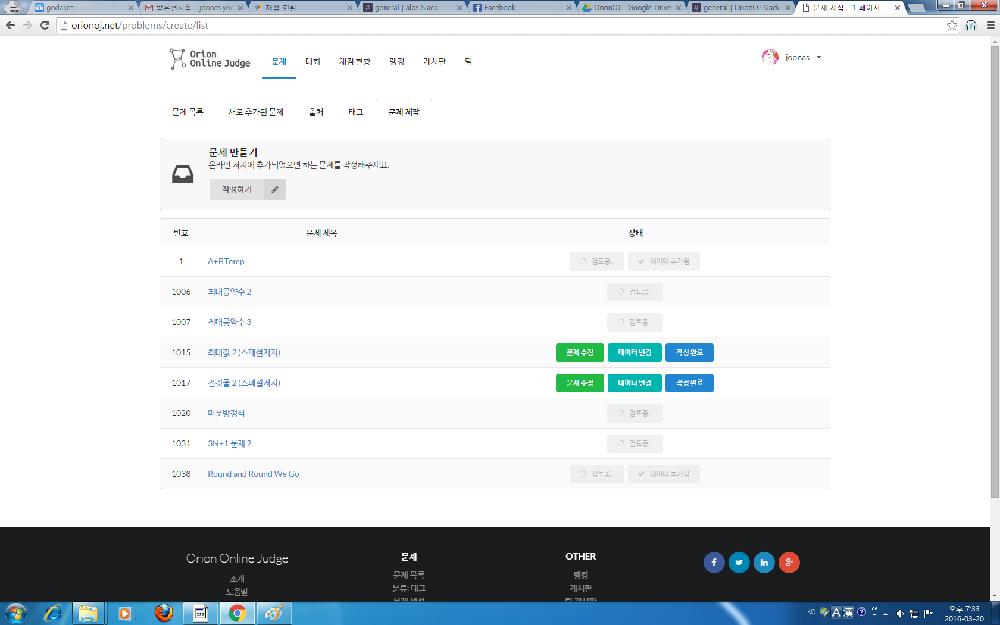
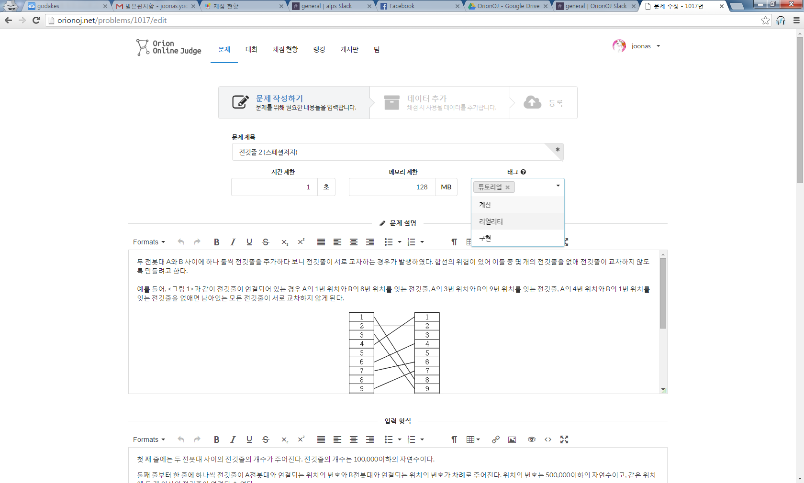
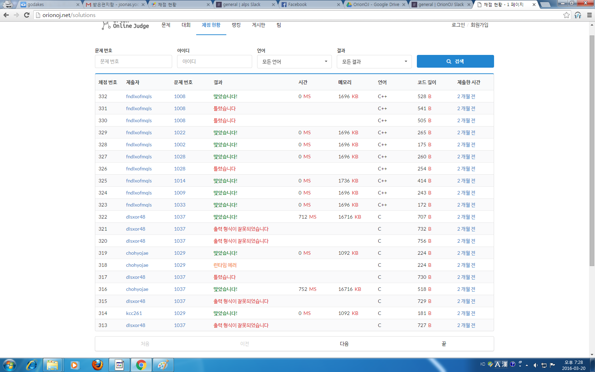
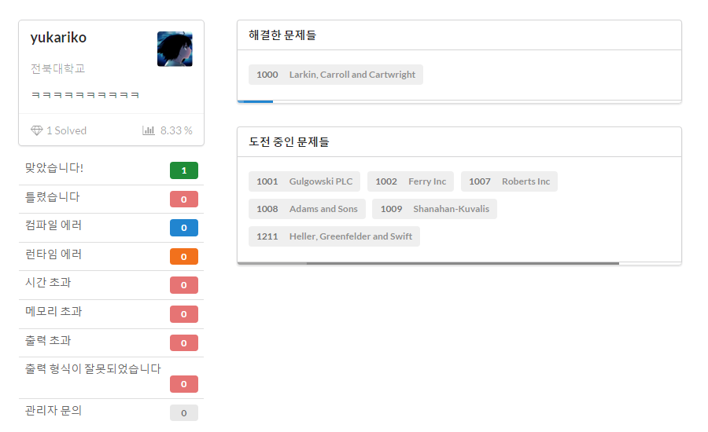
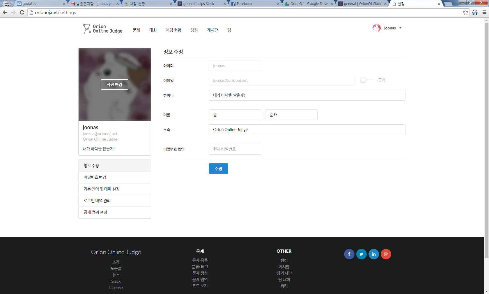

# Orion Online Judge

Online Judge

## Laravel PHP Framework

Laravel is a web application framework with expressive, elegant syntax. We believe development must be an enjoyable, creative experience to be truly fulfilling. Laravel attempts to take the pain out of development by easing common tasks used in the majority of web projects, such as authentication, routing, sessions, queueing, and caching.

Laravel is accessible, yet powerful, providing powerful tools needed for large, robust applications. A superb inversion of control container, expressive migration system, and tightly integrated unit testing support give you the tools you need to build any application with which you are tasked.

## Screenshots

## Contributor

@joonas-yoon @yukariko
